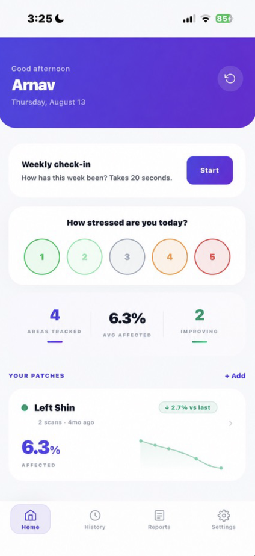
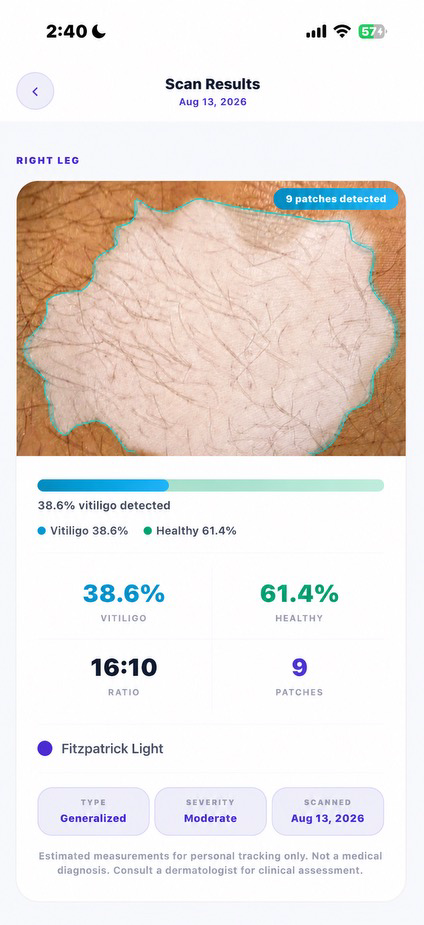
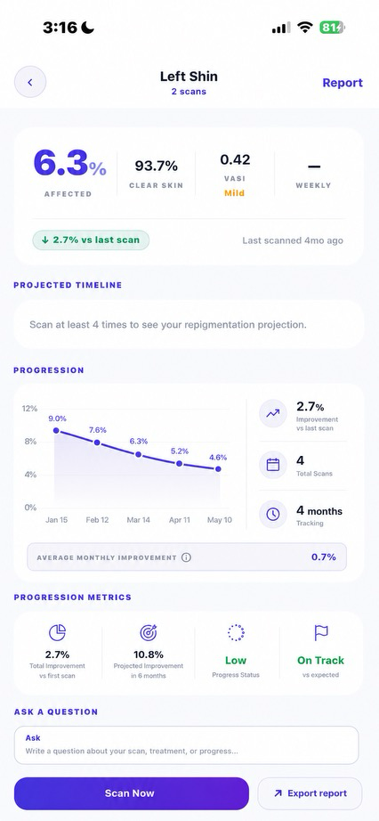

# VITImeasure

A React Native app that helps people with vitiligo photograph skin patches, receive automated coverage measurements from a backend vision pipeline, and track changes over time.

## Screenshots

| Dashboard | Results | Report |
|:-:|:-:|:-:|
|  |  |  |

## Why this exists

Vitiligo patients and their dermatologists lack a simple way to objectively measure how patches are changing between clinic visits. VITImeasure turns a phone camera into a consistent measurement tool: capture a photo, get a coverage percentage and VASI score, then compare across weeks or months.

## Tech stack

| Layer | Technology |
|-------|-----------|
| Framework | React Native 0.83 / Expo SDK 55 |
| Language | TypeScript 5.9 (strict mode) |
| Routing | Expo Router (file-based) |
| State | Zustand |
| Animation | React Native Reanimated 4 + Gesture Handler |
| Canvas | @shopify/react-native-skia (bounding-box overlays) |
| Storage | Expo SecureStore (credentials) + Expo FileSystem (scan data) |
| Auth | JWT with automatic session restore and 401 logout |
| PDF | Expo Print + Expo Sharing |
| Notifications | Expo Notifications (local scheduling) |
| Backend | Separate repo — FastAPI + OpenCV + PostgreSQL ([vitimeasure-api](https://github.com/ArnavDasoju/vitimeasure-api)) |

## Features

### Implemented in this repo (mobile frontend)

- **Camera scan flow** — oval guide overlay, auto-crop to skin region, resize to 1600px, compress to JPEG, upload to backend for analysis
- **Results display** — annotated image with cyan contour overlays rendered via Skia canvas, affected/unaffected percentages, patch count, skin tone classification, detection confidence bar
- **VASI scoring** — clinically validated Vitiligo Area Scoring Index computed from backend-provided coverage data using published body-region weights (`src/utils/vasiScore.ts`)
- **Explainability (XAI) sheet** — bottom sheet showing VASI math breakdown, confidence interpretation, trend explanation (3+ scans), stress correlation context, and scan quality tips
- **Dashboard** — patch list with sparkline trends, summary strip (total patches, scans, VASI), swipe-to-delete, pull-to-refresh
- **Patch detail + history** — per-patch scan timeline, repigmentation velocity chart with linear regression and projected milestones
- **Treatment log** — log medications per patch (name, dosage, start/end dates, notes, active/inactive status)
- **Weekly wellness check-in** — 3-step modal for stress, sleep, and mood (1–5 scale)
- **Daily stress tap** — one-tap daily stress rating, calendar heatmap visualization
- **Stress-patch correlation engine** — Pearson correlation between weekly stress scores and patch activity, with plain-English insight generation (`src/utils/correlationEngine.ts`)
- **PDF report generation** — multi-section clinical report (executive summary, progress timeline, VASI trend table, velocity analysis with projections, treatment plan, scan photo grid) exported via native share sheet
- **Cloud sync** — bidirectional sync of patches, scans, check-ins, stress entries, and treatments with the backend; offline-first with local persistence
- **Auth** — sign up, sign in, JWT token management with auto-refresh, session expiry detection, account deletion
- **Onboarding** — 3-slide walkthrough for first-time users
- **Settings** — configurable scan reminders and stress check-in notifications (user-initiated, not auto-requested), privacy policy, medical disclaimer

### Handled by the backend (separate repo)

The image analysis pipeline lives in [vitimeasure-api](https://github.com/ArnavDasoju/vitimeasure-api). This mobile app sends a cropped JPEG to `POST /api/analyzeScan` and receives back coverage percentages, bounding boxes, an annotated image, skin tone, and a detection confidence score. The mobile app does **no** on-device ML inference.

## How to run

```bash
git clone https://github.com/ArnavDasoju/vitimeasure-mobile.git
cd vitimeasure-mobile
npm install

# iOS
cd ios && pod install && cd ..
npm run ios

# Android
npm run android

# Or start the Expo dev server
npm start
```

The app connects to the production backend by default. To use a different backend:

```bash
cp .env.example .env
# Edit EXPO_PUBLIC_API_BASE_URL in .env
```

## Project structure

```
app/
  _layout.tsx            Root layout — auth guard, JWT validation, sync on launch
  (auth)/                Sign in, sign up, forgot password
  (onboarding)/          First-launch walkthrough
  (tabs)/                Tab navigator — Home, History, Reports, Settings
  scan/[bodyLocation]    Camera capture per body location
  results/               Scan results with annotated image + metrics
  patch/[bodyLocation]   Patch detail, treatment log, scan history
  report/                PDF report viewer
src/
  config.ts              Single source of truth for API URL + SecureStore keys
  components/            UI components (cards, charts, buttons, skeletons, XAI sheet)
  lib/                   Auth, centralized API client, local file storage, formatting
  services/              Cloud sync, push notifications, PDF export
  store/                 Zustand store (auth state, sync status)
  theme/                 Design tokens (colors, typography, spacing, shadows)
  types/                 TypeScript type definitions
  utils/                 VASI scoring, correlation engine, stress colors, velocity calc
```

## Demo credentials

| Field | Value |
|-------|-------|
| Email | `demo@vitimeasure.com` |
| Password | `VITIdemo2024` |

The backend is on Render's free tier — the first request after inactivity may take ~50 seconds to cold-start.

## Type checking

```bash
npm run typecheck   # tsc --noEmit, zero errors
```

## License

Contact the maintainers for licensing terms.
